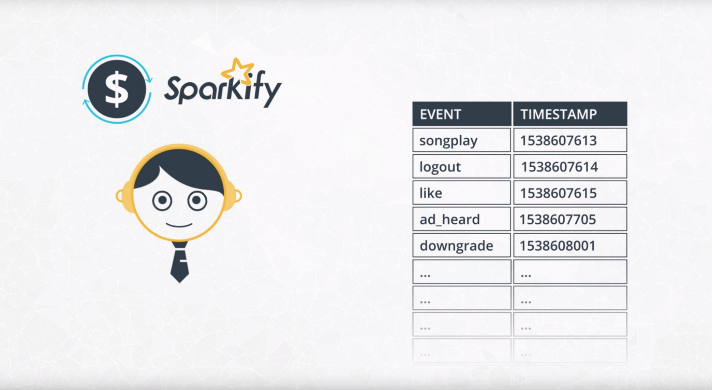
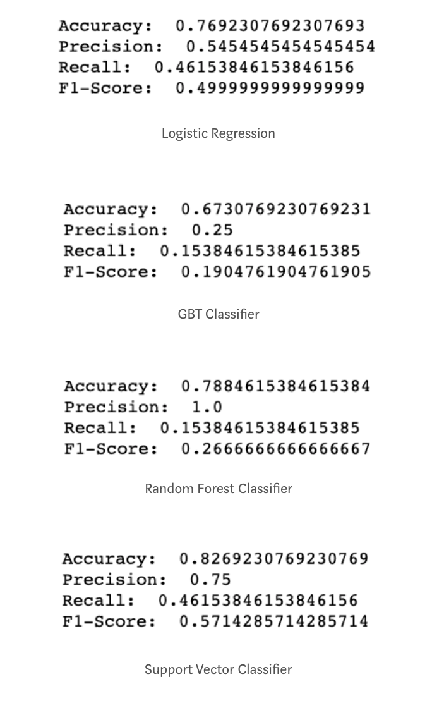
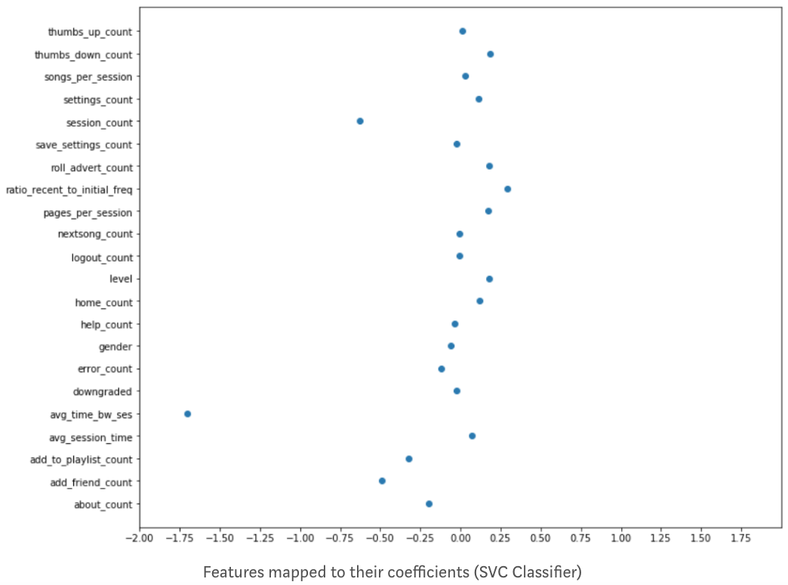

# Sparkify

##### Table of Contents  
- [Project Motivation](#project-motivation)
- [Objective](#objective)
- [Evaluation Metric](#evaluation-metric)
- [Libraries used:](#libraries-used-)
- [Files in the Repository](#files-in-the-repository)
- [Blog Post Link](#blog-post-link)
- [Features Used](#features-used)
- [Output Label](#output-label)
- [Summary of Analysis](#summary-of-analysis)
      - [Discussion on Models and their Results](#discussion-on-models-and-their-results)
      - [Discussion on Features and their importances](#discussion-on-features-and-their-importances)
- [Acknowledgements](#acknowledgements)

## Project Motivation
This project has been done as a Capstone project for the Udacity Data Scientist Nanodegree program. All data has been provided by Udacity, and is done to strengthen and display understanding of Pyspark, a Python programming interface for Apache Spark. Sparkify company in discussion here is a fictitious music streaming company. The project is later used to convey the results using a Blog post.It can be found [here](https://medium.com/@yvsajay/understanding-churn-in-music-streaming-platform-using-pyspark-a-detailed-analysis-8059ce3195b5?source=friends_link&sk=b3f16920c9fe9e434ba068ef3de20bca)

In this project, we will see how we can access huge data sets that lie across clusters using Spark via Python. The Pyspark package will help us do that. We will however work with a mini sample for this project whilst keeping in mind that the code can be used on the whole dataset as well. The results should remain the same for larger datasets too.

## Objective
Our aim is to understand the data, see the trends, use ML algorithms to determine who amongst the current users will more likely churn so that we can try different techniques to retain them even before they try to churn.

## Evaluation Metric
We use F1-score as a metric to optimize our model as we have relatively very small number of positives. AUC ROC could have been used in cases where we have a good number of positives as it relies on True positive, and False positive counts.

## Libraries used:
1. [Numpy](https://www.numpy.org/)
2. [Pandas](https://pandas.pydata.org/)
3. [Matplotlib.pyplot](https://matplotlib.org/api/_as_gen/matplotlib.pyplot.html)
4. [Pyspark](https://spark.apache.org/docs/latest/api/python/pyspark.html)
5. [Datetime](https://docs.python.org/2/library/datetime.html)

## Key Files in the Repository
1. mini_sparkify_event_data.json - Udacity provided data of a fictious music streaming app, Sparkift. It is a small subset (128mb) of a 12GB dataset.
2. Sparkify.ipynb - Jupyter notebook containing all the data exploration and analysis done along with the models.
3. Sparkify.html - The HTML file of the jupyter notebook. It is always advisable to save your work as HTML for future reference and to share with those who do not have jupyter notebook running in their systems.
4. Sparkify_blogpost_Udacity_Datascientist_Nanodegree_capstone_project.html - The HTML file of my blog post in Medium.
4. sparkify.png, sparkify_models.png, sparkify_features.png - Supporting assets for Read Me document.

## Blog Post Link
https://medium.com/@yvsajay/understanding-churn-in-music-streaming-platform-using-pyspark-a-detailed-analysis-8059ce3195b5?source=friends_link&sk=b3f16920c9fe9e434ba068ef3de20bca

## Features Used
1. Average number of songs listened by a user in each session
2. Total number of sessions of a user
3. Average number of different Pages visited in each session
4. Gender
5. Current User level — Paid or free
6. Average session time for a user
7. Number of times user visited different pages in total (creates multiple columns)
8. If a user has downgraded
9. Average time between sessions
10. Ratio of average time between sessions during later stages vs initial stages

## Output Label
1. Churn

## Summary of Analysis
##### Discussion on Models and their Results
We see that our best model in term’s of our agreed upon metric F1 score is Support Vector Classifier. We have achieved 82% accuracy and 57% F1 score on the test data post hyperparameter tuning and cross validation

I wonder if Support Vector Classifier will give us even better results if we increase our maxIter parameter. However, it is important to note that SVC is very time consuming and has taken significantly higher amount of time to train on this small dataset relatively when compared with the other models. The current best model has maxIter 200, and regParam 0.01. It has no intercept.

Logistic regression got a better F1 score without any hyperparameter tuning. It has got an F1 score of 50% without any tuning whilst only getting 47% post tuning.

Random Forests, without hyperparameter tuning got zero Precision and Recall (because of which I have to edit my evaluate_model function too to include exception handling for F1 score). Best model had 30 Trees and maxDepth 8. This is because of having zero true positives. The F1 score improved later to 26% upon refinement of the model using tuning and cross validation.

Gradient Boosting Trees has remained at an F1 score of 19% with or without tuning implying that the default parameters have been the best for this dataset. The best model has maxDepth 5, maxIter 50, and stepSize 0.1

##### Discussion on Features and their importances

The dominant features remained consistent across models.
In our winning model SVC, the features playing an important role in deciding whether a user will Churn or not are 

**Average time between sessions**. It is by far the most dominant feature. It is inversely correlated as expected. Users having more time in between sessions see less value in paying or using a platform which has a recurring monthly subscription. Even if he/she doesn't pay, they might feel the platform is not needed for them anymore.

**Session Count**, **Add friend count**, and ****Add to playlist count** also had a surprisingly negative effect which is contradicting our hypothesis.

**Ratio recent count to initial count** for which we had to feature engineer the field with more difficulty than the others had positive effect as expected. However, the extent of it was less than what we expected.

Finally, 22 features is fine to work with our models given the relatively small dataset that we worked for our project. However I strongly believe we should use PCA for feature selection before proceeding with any of our models if we want to deploy it on any large datasets.

## Acknowledgements 
Udacity for giving the direction and scope of the project along with the data.
